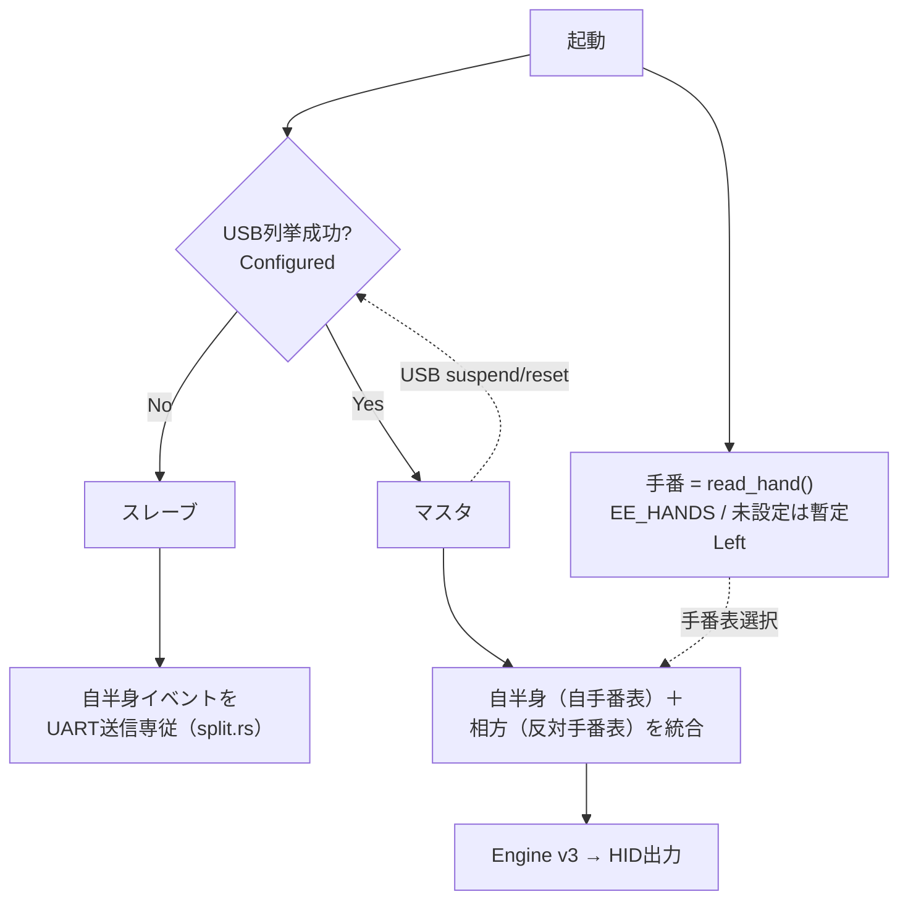
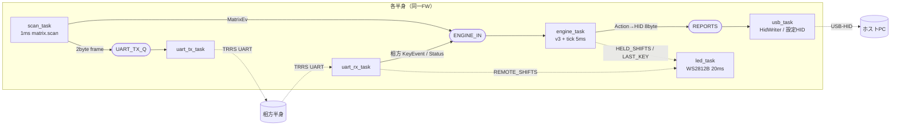
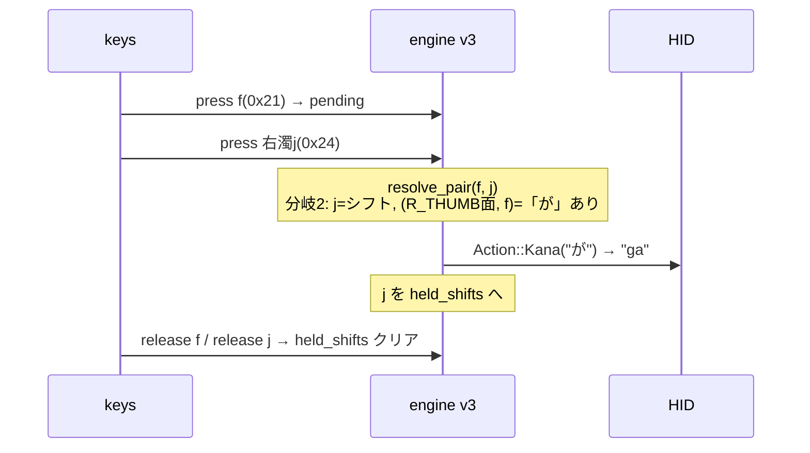
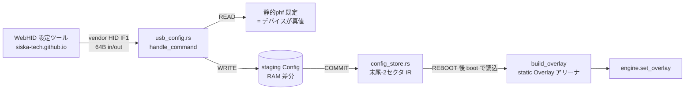

# 分割型かなキーボード（薙刀式）アーキテクチャ設計書

**プロジェクト名:** DividedKanaKeyboard
**版数:** 1.0（実装反映）
**作成日:** 2026-06-09 ／ **最終更新:** 2026-06-11
**位置づけ:** [要件定義.md](要件定義.md) を実現するための設計。実装は `naginata-core/` と `firmware/`。

> **実装状況（2026-06-11）**: 本書が記す L0〜L4 は **実装済み・実機動作**（BLE #07 を除く）。
> 本版は当初ドラフト（0.1）を **実装の実体に合わせて改訂** したもの。実装で確定/変更した主点:
> - エンジンは **v3**（窓＋候補集合モデルではなく、`pending`＋`held_shifts`＋順序非依存の2/3キー分解, §6）。
> - 役割判定は **USB列挙**（UART宣言ではない）。UART は KeyEvent/Status の2バイト自己同期フレーム、115200bps。
> - 出力型を `Action`（`Kana`/`Keys`）へ拡張。キーリピート(#11)・PCカスタマイズ(#12)を追加（§14）。
> 進捗の最新は [README.md](../README.md) ・ [issues/](../issues/README.md) を参照。

---

## 1. 関連文書とスコープ

| 文書                       | 役割                                          |
| -------------------------- | --------------------------------------------- |
| [要件定義.md](要件定義.md) | 何を作るか（機能/非機能/確定事項）            |
| 本書                       | どう作るか（構造/責務/データフロー/設計判断） |
| [README.md](README.md)     | ビルド手順・現状ステータス                    |

本書は **ファームウェア＋コアロジック** のソフトウェアアーキテクチャを対象とする。
基板/回路（`Documents/`）はインタフェース境界（§2.1ピンアサイン）としてのみ扱う。

---

## 2. システム全体アーキテクチャ

### 2.1 物理構成

```
┌─────────────────┐   TRRS(4極) / UART0    ┌─────────────────┐
│  左半身          │  GP0(TX)⇄GP1(RX)×クロス │  右半身          │
│  Pico W          │◀──────────────────────▶│  Pico W          │
│  35キー/14col×6row│      +5V / GND          │  35キー/14col×6row│
│  WS2812B / GP28  │                         │  WS2812B / GP28  │
└────────┬────────┘                         └────────┬────────┘
         │                                           │
         │   どちらか一方が USB/BLE でホストへ        │
         └──────────────┐         ┌──────────────────┘
                        ▼         ▼
                   ┌─────────────────┐
                   │   ホスト PC      │  USB-HID もしくは BLE-HID
                   │  標準ローマ字IME │  （専用ソフト不要）
                   └─────────────────┘
```

- **対称ハードウェア**: TX/RXをコネクタでクロス配線済み → 左右で**同一ファーム・同一配線**。
- **役割は固定でなく動的**: ホストに繋がった側がマスタ（§3）。

### 2.2 論理レイヤ

```
┌──────────────────────────────────────────────────────────┐
│ L4 トランスポート層   USB-HID / BLE-HID（ホスト出力）       │  firmware/usb_hid.rs
├──────────────────────────────────────────────────────────┤
│ L3 変換層            かな → ローマ字 → HID Usage           │  naginata-core/{romaji,hid}.rs
├──────────────────────────────────────────────────────────┤
│ L2 入力方式層        同時打鍵判定エンジン（薙刀式）         │  naginata-core/engine.rs
├──────────────────────────────────────────────────────────┤
│ L1 統合層            自半身＋相方のキーイベントを sc に統合  │  firmware/main.rs + keymap.rs
├──────────────────────────────────────────────────────────┤
│ L0 物理層            マトリクススキャン / 分割UART / 手番   │  firmware/{matrix,split,handedness}.rs
└──────────────────────────────────────────────────────────┘
```

**設計原則:** L2/L3（入力方式の核）を **ハード非依存の `naginata-core`** に隔離する。
理由: 検証容易（ホストで単体テスト）＋ C/C++ 移植時に核を保てる（要件§8.1）。

---

## 3. 役割モデル（マスタ/スレーブ・手番）

2軸の独立した属性で各半身の振る舞いが決まる。

| 軸       | 値                | 決定方法                              | 実装                                                                   |
| -------- | ----------------- | ------------------------------------- | ---------------------------------------------------------------------- |
| **役割** | マスタ / スレーブ | **USB列挙の成否**（VBUS電圧ではない） | firmware/main.rs `USB_CONFIGURED`（embassy-usb `Handler::configured`） |
| **手番** | 左 / 右           | **EE_HANDS**（フラッシュ保存値）      | firmware/handedness.rs                                                 |



- **動的追従**: マスタが USB suspend/切断（`StateHandler` の reset/suspend）を検出すると `USB_CONFIGURED` を落とし、再列挙でマスタへ戻る。抜き差しに追従。
- **なぜVBUSで判定しないか**: TRRSの+5Vが両半身のVBUSへ回るため、スレーブ側VBUSも5Vになり判別不能（要件§3.1）。USBデータ線の列挙（SOF/Configured）だけがホスト接続を示す。
- **手番はマスタ側だけで充足**: マスタは「自分の手番表」を自半身に、「反対手番表」を相方受信分に適用する。スレーブは生の(row,col)を送るだけでよい（`Hand::opposite()`）。

---

## 4. ソフトウェア構成（クレート/依存）

```
        ┌───────────────────────────┐
        │  naginata-firmware (bin)   │  no_std, thumbv6m-none-eabi
        │  embassy-rp/usb/time …     │
        └─────────────┬─────────────┘
                      │ depends (path)
                      ▼
        ┌───────────────────────────┐
        │  naginata-core (lib)       │  no_std（test時のみstd）
        │  phf / heapless            │  ← ホストで単体テスト 38件
        └─────────────┬─────────────┘
                      │ build-time codegen
                      ▼
        layout/naginata.yaml  ──build.rs──▶  phf テーブル(.rs)
```

- **2クレート分離**（単一ワークスペースにしない）理由: コアはホスト(std-test)、ファームは `thumbv6m` no_std。ターゲット/feature統合の衝突を避け、`cargo test` をコア側で素直に回すため。
- 依存方向は **firmware → core → (build時) layout** の一方向。逆依存なし。

### 4.1 モジュール責務一覧

| モジュール           | レイヤ | 責務                                                                                                         | 状態    |
| -------------------- | ------ | ------------------------------------------------------------------------------------------------------------ | ------- |
| `core/lib.rs`        | –      | クレート公開・`Action`（Kana/Keys/None）型定義（詳細設計 A.7）                                               | ✅      |
| `core/keymap.rs`     | L1     | 生成テーブルのアクセサ。(row,col,hand)→sc、layer/combo2/combo3/mode照合、`Hand`、ランタイム`Overlay`(#12)    | ✅      |
| `core/engine.rs`     | L2     | 同時打鍵判定 v3（シフト体系＋2/3キーコンボ＋編集モード, 大岡式遅延確定, キーリピート#11, Overlay#12）        | ✅      |
| `core/romaji.rs`     | L3     | かな→ローマ字（訓令式ベース・撥音nn・促音・拗音・長音）                                                      | ✅      |
| `core/hid.rs`        | L3     | ASCII/シンボル→USB HID（Ctrl/Shift対応）                                                                     | ✅      |
| `core/config.rs`     | –      | 設定の中間表現 IR v2（パラメータ＋全カテゴリ差分）＋serialize/parse（#12, CRC16）                            | ✅      |
| `core/build.rs`      | –      | YAML→phfコード生成（LAYERS/COMBO2/COMBO3/PREFIX2/MODE_*/MATRIX/SHIFT_KEYS/SINGLE_TAP_SCS。実行時パース無し） | ✅      |
| `fw/matrix.rs`       | L0     | 14col×6row **COL2ROW**スキャン＋デバウンス＋is_held(起動時)                                                  | ✅ 実機 |
| `fw/split.rs`        | L0     | 左右UART KeyEvent/Statusフレーム・自己同期/再同期                                                            | ✅ 実機 |
| `fw/handedness.rs`   | L0     | EE_HANDS フラッシュR/W（"NGHD"+L/R, 末尾4KBセクタ）                                                          | ✅ 実機 |
| `fw/config_store.rs` | L0     | 設定IRのフラッシュ永続化（#12, 末尾-2番目セクタ）                                                            | ✅ 実機 |
| `fw/usb_config.rs`   | L4     | PC↔端末 設定チャネル（#12, vendor HID/IF1, INFO/READ/WRITE/COMMIT/RESET/REBOOT）                             | ✅ 実機 |
| `fw/usb_hid.rs`      | L4     | HID キーボードレポート組立（IF0, 1000Hz）                                                                    | ✅ 実機 |
| `fw/main.rs`         | L1     | 役割判定(USB列挙)＋EE_HANDS＋設定適用＋6タスク配線＋LED                                                      | ✅ 実機 |

> 設計と実装の差分（当初ドラフトから実装で確定/変更した点）:
> - エンジンは **v3**（`pending`＋`held_shifts` の順序非依存分解、2/3キーコンボの遅延確定（大岡式）、編集モード）。§6 を全面改訂済み。
> - 役割判定は UART宣言ではなく **USB列挙**。UARTボーレートは **115200**。
> - 出力型を `Action`（Kana/Keys）へ拡張。**キーリピート(#11)** ・ **PCカスタマイズ(#12, ランタイムOverlay＋vendor HID)** を追加（§14）。
> 最新の進捗は [issues/](../issues/README.md) 参照。

---

## 5. データフロー（入力パイプライン）

```
 物理キー押下
   (row,col)
      │  matrix.rs: scan + debounce
      ▼
  KeyEvent(row,col,pressed)
      │  keymap::matrix_to_sc(hand)         ← 手番で表を選択
      ▼
   sc (u8: QWERTYスキャンコードID。薙刀式.txt と同じキー識別)
      │  engine.press/release/tick(sc, now) ← L2 同時打鍵判定（窓40ms・シフトレイヤ）
      ▼
   Action（詳細設計 A.7）
      ├─ Kana("か"/"きゃ"/"ふぁ" …)        ← レイヤ/2キー/3キーコンボ
      │     │  romaji::kana_to_romaji()     ← "kya" 等
      │     ▼  ローマ字 (ASCII) → hid::romaji_to_hid()
      └─ Keys([KeyPress …])                ← IME ON/OFF・Enter・編集ショートカット（直接HID）
      ▼
   KeyPress{usage,modifiers}
      │  usb_hid::report_for() → release_report()
      ▼
   8バイト HIDレポート  ──REPORTSチャネル──▶ USBタスク → ホスト
```

**キー識別子(sc)の設計判断**: 物理位置でも論理かなでもなく **「QWERTYスキャンコード相当のID」** を中間表現にした。
理由: 薙刀式の元定義（`.txt`）が `{か}|+24`、同時押し `+1e+1f` のように**スキャンコードでキーを表現**しているため、配列データを素直に転記でき、上流追従（要件IR-3）が容易になる。

---

## 6. 同時打鍵判定エンジンの状態機械（L2 詳細 / engine v3）

`engine.rs` の中核。当初ドラフトの「窓＋候補集合」モデルは廃し、**`pending`（保留1キー）＋ `held_shifts`（持続シフト集合）＋ 順序非依存の2/3キー分解** モデルへ実装した。これにより薙刀式の連続シフト・後置シフト・二重シフトが自然に成立する。詳細は [詳細設計書.md](詳細設計書.md) A 章。

### 6.1 状態

| 変数          | 型               | 意味                                                             |
| ------------- | ---------------- | ---------------------------------------------------------------- |
| `window_ms`   | u32              | 同時押し/3キー待ちの判定窓（既定40ms, ランタイム可変 #12）        |
| `held_shifts` | u8 (ShiftMask)   | 確定した**持続**シフト集合（ビットOR）。連続シフトの本体          |
| `shift_src`   | Vec<(sc,bit)>    | 各シフトビットの出所キー（解放で `held_shifts` から落とす）       |
| `pending`     | Option<(sc,t)>   | 役割未確定の1キー（次キーで2キー分解 or 窓超過で単打フラッシュ）  |
| `pend3`       | Option<(a,b,t)>  | 3キーコンボ前置の保留（外来音等。3キー目を待つ・大岡式遅延確定）  |
| `mode`        | Option<u8>       | 編集モード id（2キートリガで持続。後続キーを別表で解決）          |
| `repeat`      | Option<Repeat>   | 制御キー長押しのオートリピート状態（#11）                         |
| `overlay`     | &'static Overlay | ランタイム配列差分（#12。空なら codegen 既定と完全一致）          |

### 6.2 解決の核：`resolve_pair`（順序非依存の2キー分解）

`pending(p)` と新規キー(k) が揃った瞬間、押し順に依存せず割当を選ぶ（優先順）:

```
0)  編集モードトリガ {p,k}？           → mode へ入る（出力なし）
0.5) {p,k} が3キーコンボの前置？        → pend3 へ保留（3キー目を待つ）
1)  p=シフト & (mask(p), k) に面あり    → resolve(mask(p), k) を出力, p を held_shifts へ
2)  k=シフト & (mask(k), p) に面あり    → resolve(mask(k), p) を出力, k を held_shifts へ（後置/逆順）
3)  両方シフト                          → 双方 held_shifts へ累積（二重シフト・ベース待ち）
4)  p=シフトのみ                        → p 継続, k を単打面で出力（フォールバック）
5)  k=シフトのみ                        → p 単打, k 継続
6)  両方ベース → 2キーコンボ照合        → ヒットで combo2 出力／無ければ p単打＋k を pending（逐次）
```

- **逆順許容**（FR-3.7）は 1)/2) の両分岐で成立。「か(f,シフト)＋右濁(j,シフト)→が」のような**シフトキー同士の濁音**も両順序で拾える（v3の核心）。
- **連続シフト**（FR-3.4）は、確定したシフトが `held_shifts` に残り解放まで持続することで自然成立。`press` 時に `held_shifts≠0` なら新規キーは即 `resolve(held_shifts, k)`。

### 6.3 イベント遷移

```
press(sc):
  mode中?               → 非トリガキーを mode_action 出力（リピート対象なら repeat 開始）
  pend3中?              → 3キー目で combo3 成立 or 2キー確定後に sc を再処理
  held_shifts≠0?        → シフトキーで面あり→出力 / 別シフト→二重累積 / 通常→resolve(held_shifts,sc)
  else pending:
     None               → pending=(sc,now)
     Some(p)            → resolve_pair(p, sc)  （allow_defer=true）

release(sc):
  repeat中の sc?         → リピート停止
  mode トリガの解放?     → mode 終了
  pend3 のキー解放?      → 3キー不成立 → 2キー確定
  shift_src に sc?       → held_shifts からビットを落とす（連続シフト終了）
  pending 本体の解放?    → 単打フラッシュ（解放なのでリピート開始せず）

tick(now):
  repeat 期限到達        → action を再送, next_at=now+interval（#11）
  pend3 窓超過           → 2キー確定（3キー目は来ない）
  pending(非シフト) 窓超過 → 単打フラッシュ（押下継続中なので制御キーならリピート開始）
```

- **シフトキーの tap/hold 曖昧性**: シフト能力キーが `pending` の間は tick でフラッシュ**しない**（連続シフト待ち）。単独で解放されれば自分のベースかな、他キーが来れば 2キー分解、押し続ければ次キーで `held_shifts` 確定。
- **大岡式遅延確定**（`pend3`）: {p,k} が3キーコンボの2キー部分集合（`PREFIX2`）に一致すると即確定せず保留し、3キー目で外来音/濁音拗音を成立させる。「き＋や」は遅延し、右濁が来なければ「きゃ」（清音拗音 combo2）へフォールバック。

### 6.4 出力とオーバーレイ

- `resolve`/`combo2`/`combo3`/`mode_action` は **overlay 先引き → 静的phf** の順で引く。`overlay` が空（既定）なら静的テーブルと完全一致＝回帰なし（#12 フェーズ2）。
- 戻り値は `Action`（Kana/Keys/None, A.7）。`out: &mut dyn FnMut(Action)` へ push し、ファーム側が HID へ落とす。

> 当初ドラフト §6.4 に未実装として挙げた センターシフト/連続シフト/後置シフト/編集モード は**すべて実装済み**。`enum Output`→`Action` への拡張も完了。

---

## 7. 配列定義のビルドパイプライン

```
layout/naginata.yaml                build.rs (host, std)
┌────────────────────┐  serde_yaml   ┌──────────────────────┐
│ window_ms / tap_ms │ ────────────▶ │ Layout 構造体         │
│ shifts: [{sc,bit}] │               │  ・mask_of(when)→u8    │
│ layers: when→kana/keys │           │  ・symbol_to_keys      │
│ combo2 / combo3    │               │  ・phf_codegen::Map   │
│ modes / matrix_*   │               └──────────┬───────────┘
└────────────────────┘                          │ 生成
                                  $OUT_DIR/keymap_gen.rs
                                  ┌────────────────────────────────────┐
                                  │ WINDOW_MS / TAP_MS: u32             │
                                  │ SHIFT_KEYS: phf::Map<u8,u8>         │ sc→mask(1<<bit)
                                  │ LAYERS:  phf::Map<u16, Action>      │ (mask<<8)|sc
                                  │ COMBO2:  phf::Map<u16, Action>      │ sorted 2キー
                                  │ COMBO3:  phf::Map<u32, Action>      │ sorted 3キー
                                  │ PREFIX2: phf::Set<u16>              │ 3キーの2キー部分集合（遅延判定）
                                  │ MODE_TRIGGERS / MODE_LAYERS         │ 編集モード
                                  │ MATRIX_LEFT/RIGHT / SINGLE_TAP_SCS  │
                                  └────────────────────────────────────┘
                                          │ include!
                                  src/keymap.rs（実行時は参照のみ）
```

- **実行時パース無し**（要件§8.2-3）: MCU上はアロケータ不要・確定時間でテーブル参照。
- **キーのパック整合**: `build.rs` と `keymap.rs` の `combo2_key`/`combo3_key`/`layer_key` は**同一アルゴリズム**でソート/詰め（コメントで相互参照済み）。当初の `pack_chord`(u64) は v3 で廃止。
- **重複検出**: build.rs が同一 (mask,sc) レイヤエントリの衝突を検知して panic（配列ミスのビルド時検出）。
- **将来**: `.txt`（やまぶき形式）直読コンバータを build.rs に追加すれば上流を直接取り込める（#08, Backlog）。

---

## 8. 並行性モデル（embassy）

`main` が6タスクを spawn し、共有はチャネルとアトミックのみ（ロック競合最小）。



| タスク         | 役割                                                                                   |
| -------------- | -------------------------------------------------------------------------------------- |
| `scan_task`    | 1ms周期スキャン。変化を ① UART_TX_Q（相方へ） ② ENGINE_IN（自半身）へ                   |
| `uart_tx_task` | UART_TX_Q のフレームを相方へ送信                                                        |
| `uart_rx_task` | 相方フレームを復号。Key→相方手番で ENGINE_IN へ / Status→REMOTE_SHIFTS                  |
| `engine_task`  | **マスタ時のみ**有効（`USB_CONFIGURED`）。統合イベントを engine v3 に通し HID を REPORTS へ |
| `usb_task`     | embassy-usb。IF0=HIDキーボード(REPORTS購読) ＋ IF1=設定vendor HID(#12)。`Handler` で役割判定 |
| `led_task`     | `main` の末尾ループ。役割色＋シフト状態を WS2812B 2個へ。マスタは Status を相方へ送る   |

- **チャネル**: `REPORTS`(HID 8byte×16) / `ENGINE_IN`(MatrixEv×32) / `UART_TX_Q`([u8;2]×32)。`ThreadModeRawMutex`。
- **アトミック**: `USB_CONFIGURED`(役割) / `HELD_SHIFTS`・`REMOTE_SHIFTS`(LED) / `LAST_KEY`(#12 learn-key)。
- **役割ゲート**: engine_task は `USB_CONFIGURED==false`（スレーブ）なら変換せず素通り。スレーブは scan→UART送信のみで誤出力しない（NFR-4）。
- **送出は `try_send`**: 満杯時はレポート落ちの可能性（PoC既知課題）。人間打鍵速度では実機で問題は出ていない。

---

## 9. 主要シーケンス

### 9.1 単打「か」
```
matrix: (r,c)=press ─▶ keymap: sc=0x21 ─▶ engine.press(0x21) → pending
key離す ─▶ engine.release(0x21) ─▶ flush_pending ─▶ Action::Kana("か")
"か" ─▶ romaji "ka" ─▶ hid {k},{a} ─▶ [press k][release][press a][release] ─▶ USB
```
（`f`=0x21 はシフト能力キーだが、単独tapでは自分のベースかな「か」を出す。A.3）

### 9.2 濁音「が」（シフトキー同士・順序非依存）



逆順（j→f）でも分岐1で同じく「が」。これが v3 の核心（当初の pack モデルでは不可だった）。

### 9.3 マスタが相方分を統合
```
uart_rx: 相方 KeyEvent(row,col,pressed)   ← スレーブから2byte（自己同期）
 ─▶ keymap::matrix_to_sc(local_hand.opposite(), row,col)
 ─▶ ENGINE_IN ─▶ engine.press/release（自半身と同じ engine に合流）
```

---

## 10. メモリ/フラッシュ・レイアウト

```
RP2040 2MB Flash（末尾2セクタを永続領域に使用）
┌──────────┬───────────────────────────┬──────────────┬──────────────┐
│ BOOT2    │ プログラム(.text/.rodata) │ 設定IR(#12)  │ EE_HANDS(#05) │
│ 0x100    │ 配列テーブルもここ(rodata) │ 末尾-2 4KB   │ 末尾 4KB      │
└──────────┴───────────────────────────┴──────────────┴──────────────┘
RAM 256KB : スタック / engine状態 / チャネルバッファ / Overlayアリーナ(#12)
```

- 配列テーブルは `rodata`（フラッシュXIP）に置かれRAMを消費しない。
- **EE_HANDS**（handedness.rs）: 末尾4KBセクタ先頭に `"NGHD"+'L'/'R'`。書込みは初回プロビジョニングのみ。
- **設定IR**（config_store.rs, #12）: 末尾から**2番目**の4KBセクタに `config` の IR（"NGCF"+v2+params+差分+CRC16）。未保存/破損なら codegen 既定へフォールバック。
- フラッシュ書込みは embassy-rp の `blocking_erase/write`（内部で core1停止＋critical_section＝XIP無効化を安全化）。

---

## 11. エラー処理・信頼性

| 事象         | 方針                                                       | 実装箇所        |
| ------------ | ---------------------------------------------------------- | --------------- |
| チャタリング | 連続一致 `DEBOUNCE_TICKS` で確定                           | matrix.rs       |
| UART同期外れ | 先頭バイトの SYNC(bit7) 欠落・復号失敗で破棄→次フレーム頭で再同期 | split.rs / uart_rx |
| TRRS抜き差し | 役割を動的再判定（`Handler` の reset/suspend で `USB_CONFIGURED` を落とす） | main.rs `StateHandler` |
| スレーブ単独 | マスタ不在でも誤出力しない（USB未列挙→engine_task が素通り） | main.rs         |
| 設定破損     | 設定IRの magic/CRC 不一致で `Config::default()` 復帰        | config_store.rs |
| 未知sc/かな  | 黙って無視（`Action::None`）。単打面へフォールバック         | engine/keymap   |

---

## 12. 設計上のトレードオフ（記録）

1. **中間表現に sc を採用** … 上流(.txt)追従◎ / 物理配線とは別表が必要（matrix表）。
2. **YAML＋ビルド時codegen** … 実行時軽量◎・可読◎ / ビルド依存(serde_yaml)が増える。
3. **コアをno_std分離** … テスト容易◎・移植容易◎ / firmwareとの境界設計が要る。
4. **engine v3（pending＋held_shifts の順序非依存分解）** … 連続/後置/二重シフトを単一モデルで自然表現◎ / 当初の窓＋候補集合(u64 pack)より状態が増える。実装済み。
5. **2クレート非ワークスペース** … target衝突回避◎ / 依存パス管理が手動。
6. **#12 ランタイムOverlay（静的phf＋差分の二段引き）** … 再ビルド無しで配列変更◎・空なら回帰ゼロ◎ / boot時 static アリーナへ unsafe 展開が必要。

---

## 13. C/C++ 移植指針（§8.1 フォールバック時）

BLEがRustで詰まり pico-sdk(C/C++)へ移る場合でも、**L2/L3の設計はそのまま移植**できる:
- `engine`（v3 の `pending`＋`held_shifts` 状態機械）→ C構造体＋関数群へ機械的に対応。
- `LAYERS/COMBO2/COMBO3/MATRIX` → build時codegenを「C配列＋gperf(パーフェクトハッシュ)」に置換。
- `romaji`/`hid` → 純粋関数なので移植容易。
- L0/L4のみ pico-sdk + TinyUSB + BTstack で再実装。

→ 「核は言語非依存」を満たすため、移植コストは L0/L4 に限定される。

---

## 14. 追加機能（実装で拡張した範囲）

当初ドラフトのスコープ外だが実装した機能。詳細は各 issue を参照。

### 14.1 キーリピート（#11 / FR-7.1）
編集モードの制御キー（BS/Del/←→↑↓）と単打面の制御キーを長押しすると、初回ディレイ（既定300ms）後に一定間隔（既定40ms）で再送する。engine の `repeat` 状態が `tick` で期限管理し、キー解放・モード終了で停止。リピート対象は「単一・修飾なしの所定 Usage」のみ（コピー等の修飾付きは誤爆防止で除外）。

### 14.2 PCカスタマイズ（#12 / FR-7.1, FR-7.3）
再ビルド無しで配列・パラメータを編集する仕組み。WebHID 設定ツール（別リポジトリ `siska-tech.github.io/naginata-config/`）から操作する。



- **プロトコル**: vendor-defined HID（IF1, usagePage 0xFF00, 64B）。`INFO/READ_DEFAULTS/READ_OVERRIDES/WRITE/COMMIT/RESET/REBOOT/READ_PARAMS/WRITE_PARAMS/READ_MATRIX/READ_LASTKEY`。
- **真値はデバイス**: 既定は静的phfを直接走査して返す。フラッシュには**差分(Config)のみ**保存し、boot で「既定＋差分」をマージ（`Overlay` は静的テーブルの先引き層）。
- **反映**: WRITE はステージング更新のみ。COMMIT でフラッシュ保存し **REBOOT 後**に反映（boot 一回展開で実行時コスト無し）。
- **対象カテゴリ（IR v2）**: 単打/シフト面 layers・combo2・combo3・編集モード modes・未使用物理キーの直接割当 extra・パラメータ（窓/tap/リピート/LED輝度）。
- **learn-key**: `READ_LASTKEY` が最後に押された物理位置を返し、未使用キーへの直接割当（フェーズ3）を支援。

---

## 付録: 主要パラメータ既定値

| パラメータ       | 既定       | 出典   | 変更箇所                                   |
| ---------------- | ---------- | ------ | ------------------------------------------ |
| 同時打鍵判定窓   | 40 ms      | §8.2-2 | layout `window_ms`／設定IR params(#12)     |
| tap窓            | 40 ms      | A.3    | layout `tap_ms`／設定IR params(#12)         |
| デバウンス       | 3 tick     | FR-1.3 | matrix.rs `DEBOUNCE_TICKS`                  |
| スキャン周期     | 1 ms       | FR-1.2 | main.rs scan_task                          |
| engine tick      | 5 ms       | §6.3   | main.rs engine_task                        |
| キーリピート遅延 | 300 ms     | FR-7.1 | engine `REPEAT_DELAY_MS`／設定IR(#11,#12)   |
| キーリピート間隔 | 40 ms      | FR-7.1 | engine `REPEAT_INTERVAL_MS`／設定IR(#11,#12)|
| UARTボーレート   | 115200     | FR-2.3 | main.rs UART init                          |
| USB poll         | 1 ms(IF0)  | NFR-1  | main.rs usb_task（1000Hz）                  |
| マトリクス       | 14col×6row | §2.1   | matrix.rs                                  |
