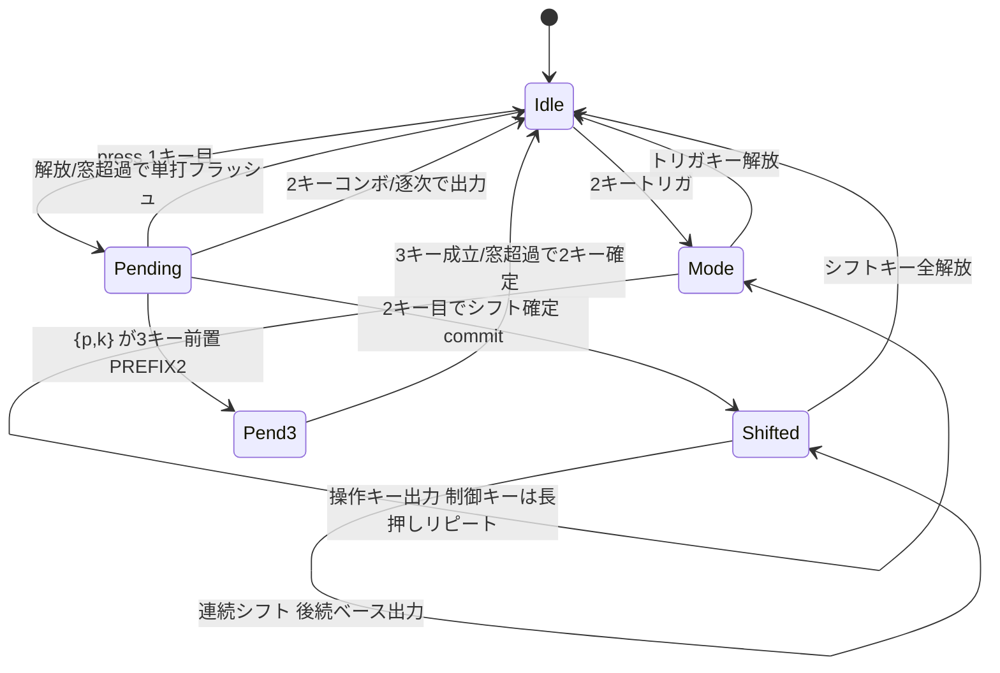
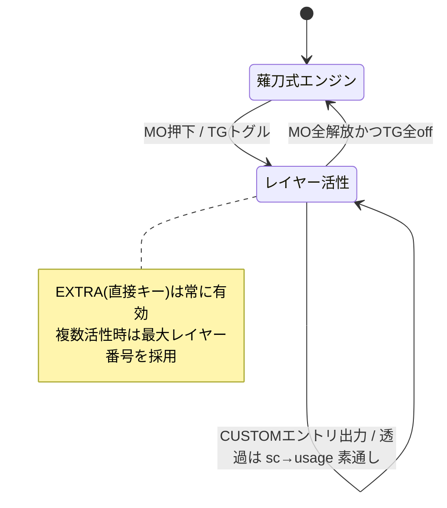

# 分割型かなキーボード（薙刀式）詳細設計書（焦点型）

**版数:** 1.1（fw 0.3 拡張反映）
**作成日:** 2026-06-09 ／ **最終更新:** 2026-06-12
**位置づけ:** [アーキテクチャ設計書.md](アーキテクチャ設計書.md) を受け、当初は**未実装かつ複雑な部分**を実装前に詳細化した。本版は **実装の実体（as-built）に合わせて改訂**。

> **実装状況（2026-06-12）**: 本書 A〜D・G は**実装済み・実機動作**。当初ドラフトから実装で確定/変更した主点を本版で反映:
> - **A**: engine v3 — `pending`＋`held_shifts`＋順序非依存の `resolve_pair`／3キーは大岡式遅延確定（`pend3`）／編集モードは2キートリガの持続モード。
> - **C**: UART は **2バイト自己同期フレーム（KeyEvent / Status）** ・**115200bps**。役割ネゴは UART宣言ではなく **USB列挙**（C.4 改訂）。
> - **D**: 役割=USB列挙。手番プロビジョニングは「スペース＋上段キー」起動。設定IRは末尾-2セクタ（#12）。
> - **G（v1.1 追加）**: fw 0.3 拡張 — ホールド（TAG_HOLD）・レイヤー（QWERTY パススルー／任意カスタム）・
>   全物理キー/形状の実機読み出し・INFO capability ビット（naginata-config #05-future-work 実装分）。
> 加えて **キーリピート(#11)** ・ **PCカスタマイズ(#12)** を実装（アーキ設計書 §14）。コア70テスト緑。
> 最新の状態は [README.md](../README.md) ・ [issues/](../issues/README.md) を参照。

## 対象範囲（と非対象）

| #   | 対象（本書で詳細設計する）                                                   | 理由                                                 |
| --- | ---------------------------------------------------------------------------- | ---------------------------------------------------- |
| A   | **薙刀式シフト体系**（単打/センター/連続/後置/二重シフト・濁音/拗音/外来音） | 現フラットモデルでは表現不可。最重要・手戻りリスク大 |
| B   | **配列データ仕様**（レイヤベースYAML / 符号化）                              | Aの実装前提。.txt転記の受け皿                        |
| C   | **分割UARTプロトコル**（フレーミング/再同期/役割ネゴ）                       | 信頼性要件 FR-2.4/2.5                                |
| D   | **役割判定（USB列挙）＋EE_HANDS手順**                                        | §3.1の具体手順が未定                                 |

**非対象**: 実装・テスト済みの `romaji.rs` / `hid.rs` / `engine`の窓判定基盤。これらは「テスト＋アーキ設計書」を仕様とみなす。本書Aは現engineを**拡張**する差分設計。

---

# A. 薙刀式シフト体系 詳細設計

## A.1 現モデルの限界と新モデルの方針

現 `engine.rs` は「窓内の sc 集合 → flat な single/combo 照合」。これでは薙刀式の以下が表現できない：

- **連続シフト**: シフトキーを押し続ける間、**後続の複数キー**すべてにシフトが掛かる（窓を跨ぐ持続状態）。
- **後置シフト**: ベースキーを先、シフトを後に押す**順序依存**。
- **二重シフト**: シフト2種の同時適用。

→ **レイヤモデル**へ拡張する。薙刀式の元定義 `.txt` 自体が
`({シフト}[ 位置→かな ]` という「**シフト集合をトリガとする面**」の構造をしているため、これに忠実：

```
出力 = LAYER[ 現在アクティブなシフト集合 ][ ベースキー sc ]
```

単打・センターシフト・濁音・拗音・外来音は**すべてこの1モデルに統一**される
（トリガ集合の要素数 0〜2 で表現）。

## A.2 キー役割モデル

各 sc は「ベース面（かな）」を必ず持ち、加えて一部は**シフト能力**を持つ二面性キー。

| 役割         | 定義                                                           | 例                                               |
| ------------ | -------------------------------------------------------------- | ------------------------------------------------ |
| `Base`       | 単打でかなを出す                                               | 大半のキー                                       |
| `Shift(bit)` | 他キーと併用時にシフトとして働く。**単打時は自分のベースかな** | space, 右濁(j), 左濁(f), 右半(m), 左半(v), 小(q) |

シフトビット割当（`ShiftMask: u8`、最大8種。**実装値** — layout/naginata.yaml `shifts` ＋ firmware の LED 定数と一致）:

| bit | 名称    | sc   | キー  | 用途（薙刀式）     | LED色  |
| --- | ------- | ---- | ----- | ------------------ | ------ |
| 0   | CENTER  | 0x39 | space | センターシフト     | シアン |
| 1   | R_THUMB | 0x24 | j     | 濁音（右）         | 赤     |
| 2   | L_THUMB | 0x21 | f     | 濁音（左・逆手）   | 赤     |
| 3   | R_MID   | 0x32 | m     | 半濁音（右）       | 黄     |
| 4   | L_MID   | 0x2F | v     | 半濁音（左・逆手） | 黄     |
| 5   | SMALL   | 0x10 | q     | 小書き             | 青     |

> `space` は Set-1 で 0x39（当初ドラフトの 0x2C は誤り、実装で 0x39 に確定）。
> ビットは `keymap::shift_mask_of(sc)→1<<bit` で引く。LED 色は firmware/main.rs `shift_color`。

## A.3 シフトキーの tap/hold 曖昧性解決

シフト能力キーは「単打かな」か「シフト」かを実行時に判定する（ホームロウMod同型）。

```
shift_key 押下 → 状態 Ambiguous（保留）
  ├─ tap_window(=既定40ms) 内に “単独で” 解放      → Base 確定（自分のかなを出力）
  ├─ 押下中に他キーが押された                      → Shift 確定（held_shifts へ commit）
  └─ tap_window 経過しても保持中                    → Shift 確定（連続シフト開始）
```

- `tap_window` は判定窓と同一既定値（40ms, 実機調整）。
- Shift確定後、そのキーが解放されるまで `held_shifts` に残る → **連続シフト**が自然に成立。

## A.4 状態（engine v3・実装）

```rust
pub struct Engine {
    window_ms: u32,
    held_shifts: u8,                // 確定した持続シフト集合（ShiftMask）→ 連続シフト
    shift_src: Vec<(u8, u8), 8>,    // (sc, bit) 確定シフトの出所（解放で落とす）
    pending: Option<(u8, u32)>,     // 役割未確定の1キー（次キーで2キー分解 or 単打フラッシュ）
    pend3: Option<(u8, u8, u32)>,   // 3キー待ち: 保留した2キー(a,b)+時刻（大岡式遅延確定）
    mode: Option<u8>,               // 編集モード id（2キートリガで持続）
    mode_keys: (u8, u8),            // 編集モードのトリガキー（終了判定用）
    repeat: Option<Repeat>,         // 制御キー長押しのオートリピート（#11）
    repeat_delay_ms: u32,           // 初回ディレイ（既定300ms）
    repeat_interval_ms: u32,        // 以降の間隔（既定40ms）
    overlay: &'static keymap::Overlay, // ランタイム配列差分（#12, 既定は空）
}
```

> 当初の v2 案（`held` 集合・`ambiguous` Vec・`pending_base` 単独）は、`pending`＋`resolve_pair`（順序非依存の2キー分解）に統合された。後置/前置/逆順をすべて `resolve_pair` の分岐で扱う（A.6）。

主要状態の遷移（簡略）:



## A.5 レイヤ解決（レイヤ × ベース → 出力）

ベースキー `b` を `mask` の面で解決する瞬間の手順（`keymap::layer_lookup`／engine の `resolve` は overlay 先引き）：

```
fn resolve(mask: ShiftMask, b: sc) -> Action:
    # 0) #12 オーバーレイ（差分）を先に引く: overlay(mask,b) > overlay(0,b)
    # 1) 厳密一致レイヤ: LAYERS[(mask<<8)|b]
    if let Some(a) = LAYERS.get((mask,b)): return a
    # 2) フォールバック: 単打面 LAYERS[(0<<8)|b]
    if let Some(a) = LAYERS.get((0,b)):    return a
    # 3) 未定義
    return Action::None
```

- `LAYERS` は `phf::Map<u16, Action>`（キー=`(mask<<8)|sc`）。1表に全面を畳んだ（当初の「mask ごとに1表」より MCU 上で簡潔）。
- **逆順/順不同**はトリガ集合 `mask` がビットORで可換なので自然成立。
- `has_layer(mask,b)`（厳密エントリの存在判定。フォールバックしない）が、A.6 のシフト/ベース割当の判断に使われる。

## A.6 順序非依存の2キー分解（`resolve_pair`）— 前置/後置/逆順/二重を統一

当初案の「`pending_base` への後置遡及」は、`pending(p)` と新規キー(k) を**押し順に依存せず**解決する `resolve_pair(p, k)` に一般化した。優先順で割当を選ぶ：

```
fn resolve_pair(p, k, allow_defer):
  0)   mode_trigger(p,k)?              → 編集モードへ（出力なし）
  0.5) allow_defer & is_combo3_prefix(p,k)? → pend3=(p,k,now)（3キー目を待つ・大岡式）
  1)   p=シフト & has_layer(mask(p),k) → emit resolve(mask(p),k); commit(p)     … 前置
  2)   k=シフト & has_layer(mask(k),p) → emit resolve(mask(k),p); commit(k)     … 後置/逆順
  3)   両方シフト                      → commit(p); commit(k)                    … 二重シフト（ベース待ち）
  4)   p=シフトのみ                    → commit(p); emit resolve(mask(p),k)      … フォールバック
  5)   k=シフトのみ                    → emit resolve(0,p); commit(k)
  6)   両方ベース → combo2(p,k)?       → ヒットで emit／無ければ emit resolve(0,p); pending=(k,now)
```

- **後置**「が」（f→濁点後ではなく、ベース→シフト順）も、シフトが後に来た k 側の分岐2で `has_layer` が成立すれば遡及的に確定する。**前置**（シフト→ベース）は分岐1。**逆順のシフト同士**（f↔j）は分岐1/2のどちらかで対称に成立。
- `commit(sc,bit)` は `held_shifts |= bit` ＋ `shift_src` へ出所を記録。これで連続シフトが持続（解放で落ちる）。
- `pending` の単独解放・窓超過は `flush_pending`（`resolve(held_shifts, p)`）で単打確定。シフト能力キーが pending の間は tick でフラッシュ**しない**（連続シフト待ち, A.3）。

### A.6.1 3キーコンボの遅延確定（`pend3`・大岡式）

`{p,k}` が3キーコンボの2キー部分集合（`PREFIX2`）に一致すると、2キーで確定せず `pend3` へ保留して3キー目を待つ：

- 3キー目到達 → `combo3(a,b,sc)` 成立で出力（外来音「でぃ」・濁音拗音「ぎゃ」等）。
- 窓超過 / ペアのキー解放 → 3キー目は来ないと判断し `resolve_pair(a,b, allow_defer=false)` で2キー確定（「で」「きゃ」へフォールバック）。
- これで「き＋や」(清音拗音 combo2) と「右濁＋き＋や」(濁音拗音 combo3) の曖昧性を解消する。

## A.7 出力型の拡張

かな以外（IME制御/編集モード/記号直接）を扱うため、戻り値を拡張：

```rust
enum Action {
    Kana(&'static str),         // → romaji → HID（既存経路）
    Keys(&'static [KeyPress]),  // 直接キー列（Enter, IME ON/OFF, ^c 等）
    None,
}
```

- `Kana` は `romaji::kana_to_romaji → hid::romaji_to_hid` をそのまま通す（既存経路）。
- `Keys` は romaji を経由せず直接 HID（編集モードのショートカット、`LANG1`=IME ON 等）。`KeyPress{usage, modifiers}`。
- 編集モード（FR-4.2）は「特定2キー同時で持続モードへ入り、続く打鍵を別表 `MODE_LAYERS` で解決」＝ レイヤ機構の応用（`mode` 状態＋トリガ2キー）。

## A.8 ワーク例（受入観点・実機/テスト確認済み）

| 入力（時系列）              | 期待             | 効く機能                     | 対応テスト                                |
| --------------------------- | ---------------- | ---------------------------- | ----------------------------------------- |
| f 単打                      | "か"             | シフトキーの単打=ベース      | `shift_key_tap_is_its_base`               |
| space+u位置 同時            | "さ"             | センターシフト（前置/後置）  | `center_shift_prefix/postfix`             |
| space(hold)→u→y             | "さ","よ"        | 連続シフト                   | `continuous_shift_applies_*`              |
| f(濁,シフト)+j(右濁,シフト) | "が"（両順序）   | シフト同士の濁音（v3核心）   | `dakuten_shift_base_both_orders`          |
| j(hold)→w→f                 | "ぎ","が"        | 連続濁音（ベース＋シフト基） | `continuous_dakuten_including_shift_base` |
| 右濁j+て+い (3キー)         | "でぃ"           | 外来音3キー（大岡式遅延）    | `gairai_di_3key`                          |
| き+や (2キー)               | "きゃ"（両順序） | 清音拗音 combo2              | `seion_youon_kya`                         |
| j+h                         | LANG1（IME ON）  | Action::Keys                 | `ime_on_emits_keys`                       |
| D+F(hold)→j                 | ↑（カーソル）    | 編集モード + Action::Keys    | `edit_mode1_cursor`                       |
| 編集モードで m 長押し       | ← 連続移動       | キーリピート(#11)            | `repeat_left_after_delay_*`               |

---

# B. 配列データ仕様（レイヤ＋コンボ＋モード）

## B.1 YAML スキーマ（実装）

`layout/naginata.yaml`（要素は配列 `[{sc,k}]` 形式。serde で `KanaEntry{sc,k}` / `KeysEntry{sc,syms}` に対応）：

```yaml
window_ms: 40
tap_ms: 40

# シフト能力キー（A.2・実装値）
shifts:
  - { name: CENTER,  sc: 0x39, bit: 0 }   # space
  - { name: R_THUMB, sc: 0x24, bit: 1 }   # j 右濁
  - { name: L_THUMB, sc: 0x21, bit: 2 }   # f 左濁
  - { name: R_MID,   sc: 0x32, bit: 3 }   # m 右半
  - { name: L_MID,   sc: 0x2f, bit: 4 }   # v 左半
  - { name: SMALL,   sc: 0x10, bit: 5 }   # q 小書き

# レイヤ: when=トリガのシフト名集合, kana/keys = base sc → 出力
layers:
  - when: []                              # 単打面
    kana: [ { sc: 0x11, k: "き" }, ... ]
    keys: [ { sc: 0x16, syms: ["BS"] }, ... ]   # 単打面の制御キーも可
  - when: [CENTER]                        # センターシフト面
    kana: [ { sc: 0x16, k: "さ" }, ... ]
  - when: [R_THUMB]                       # 濁音面
    kana: [ { sc: 0x11, k: "ぎ" }, ... ]
    keys: [ { sc: 0x23, syms: ["LANG1"] } ]     # IME ON

# 2キー同時押し（非シフト・清音拗音 等。順不同）
combo2:
  - { keys: [0x11, 0x23], k: "きゃ" }
# 3キー同時押し（外来音・濁音拗音 等。順不同）
combo3:
  - { keys: [0x24, 0x12, 0x25], k: "でぃ" }
# 編集モード（2キートリガ→持続モード→後続キーを操作へ）
modes:
  - id: 1
    trigger: [0x20, 0x21]                 # D+F
    map: [ { sc: 0x24, syms: ["Up"] }, { sc: 0x18, syms: ["Del"] }, ... ]

matrix_left:  [ { row, col, sc }, ... ]   # 実機採取の実配線
matrix_right: [ { row, col, sc }, ... ]

# fw 0.3（G章）: 薙刀式未割当の物理スイッチと、キー形状（実機採取 2026-06-12）
physical_left:  [ { row, col }, ... ]              # ESC/F行・Macro列・親指行 等
physical_right: [ { row, col }, ... ]
layout_left:  [ { row, col, x, y, w, h, rot }, ... ] # u単位float（0.25u量子化）。w/h省略=1u
layout_right: [ { row, col, x, y, w, h, rot }, ... ]
```

## B.2 符号化（build.rs codegen → keymap_gen.rs）

実行時パース無し。生成テーブル（すべて phf）：

| 生成物              | 型                       | キー                       | 用途                                                                        |
| ------------------- | ------------------------ | -------------------------- | --------------------------------------------------------------------------- |
| `WINDOW_MS/TAP_MS`  | `u32`                    | –                          | 既定パラメータ                                                              |
| `SHIFT_KEYS`        | `phf::Map<u8,u8>`        | sc → `1<<bit`              | シフト能力判定                                                              |
| `LAYERS`            | `phf::Map<u16,Action>`   | `(mask<<8)\|sc`            | レイヤ解決（A.5）                                                           |
| `COMBO2`            | `phf::Map<u16,Action>`   | sorted 2キー               | 清音拗音 等                                                                 |
| `COMBO3`            | `phf::Map<u32,Action>`   | sorted 3キー               | 外来音 等                                                                   |
| `PREFIX2`           | `phf::Set<u16>`          | 3キーの2キー部分集合       | 大岡式遅延判定（A.6.1）                                                     |
| `MODE_TRIGGERS`     | `phf::Map<u16,u8>`       | sorted 2キー → mode id     | 編集モード入り                                                              |
| `MODE_LAYERS`       | `phf::Map<u16,Action>`   | `(mode<<8)\|sc`            | 編集モードのキー操作                                                        |
| `MATRIX_LEFT/RIGHT` | `phf::Map<u8,u8>`        | `(row<<4)\|col` → sc       | 手番別マトリクス                                                            |
| `SINGLE_TAP_SCS`    | `&[u8]`                  | –                          | #12 PC編集対象の単打sc列挙                                                  |
| `PHYS_LEFT/RIGHT`   | `&[(u8,u8)]`             | (`(row<<4)\|col`, sc) 昇順 | 全物理スイッチ（matrix∪physical, sc=0=未割当）。READ_MATRIX_FULL（G.4）     |
| `LAYOUT_LEFT/RIGHT` | `&[(u8,u8,u8,u8,u8,i8)]` | (pos, x,y,w,h, rot)        | キー形状（0.25u単位/度）。READ_LAYOUT（G.4）。空なら capability LAYOUT 不立 |

- `when` のシフト名集合 → `mask_of`（bitOR）で `ShiftMask`。`(mask<<8)|sc` を LAYERS のキーに。
- `keys`/`modes` の `syms`（`"LANG1"`/`"BS"`/`"C-c"`/`"S-Right*20"` 等）は `symbol_to_keys` で `KeyPress` 列へ（`NAME*N` でリピート展開）。
- ビルド時に **(mask,sc) 重複を panic 検出**。`pack`(u64) は v3 で廃止（`combo2_key`/`combo3_key` のソート詰めに統一、keymap.rs と同一実装）。

## B.3 .txt からの転記方針

`.txt` の各 `({トリガ}[ … ]` ブロック ⇔ 1レイヤ（when=トリガ）。
将来 build.rs に `.txt`直読コンバータを足せば上流追従（IR-3, #08 Backlog）。当面は手動でYAML化。v15配列定義（大岡俊彦氏作成）は `Documents/Reference/`（非公開・git管理外）。

---

# C. 分割UARTプロトコル 詳細設計

## C.1 物理 / リンク

- UART0: GP0=TX, GP1=RX。**TX/RXコネクタクロス**済（左右同一）。
- ボーレート **115200**・8N1（確実性優先。当初案の921600から実装で確定。FR-2.3）。
- 1イベント=2byteのため帯域は十分。レイテンシ目標 ≦2ms（FR-2.2）。

## C.2 フレーム形式（実装 / split.rs）

**2バイト固定・自己同期**。先頭バイトのみ SYNC(bit7=1)、従属バイトは bit7=0。役割宣言フレームは持たない（役割は USB で決まる, C.4）。

```
共通: b0 = [7]SYNC=1 [6]TYPE(0=Key,1=Status) ...    b1 = [7]=0 ...

KeyEvent (スレーブ→マスタ, type=0):
  b0: 1 0 P _ _ R R R     P=pressed, RRR=row(0..5)
  b1: 0 0 0 0 C C C C      CCCC=col(0..13)
Status (マスタ→スレーブ, type=1, LED表示用):
  b0: 1 1 0 0 0 0 0 0
  b1: 0 0 M M M M M M      MMMMMM=ShiftMask(6bit)
```

- `KeyEvent::encode` / `encode_status` / `decode(b0,b1)→Option<Frame>`。`Frame = Key(KeyEvent) | Status(u8)`。
- 当初案の検査ビット複製は**不採用**（SYNC位置＋ビット幅制約で十分。短フレーム）。

## C.3 再同期（FR-2.4）

```
uart_rx_task:
  1バイト b0 を読む
  if b0.bit7==0: 同期外れ → 読み捨て（次の SYNC まで continue）
  1バイト b1 を読む
  decode(b0,b1):
    Frame::Key(ev)    → 相方手番(local_hand.opposite())で ENGINE_IN へ
    Frame::Status(m)  → REMOTE_SHIFTS = m（スレーブのLED用）
    None              → 破棄（次フレーム頭へ）
```

- ケーブル抜き差し・ノイズ後は次の SYNC バイトで自動復帰。状態を持たないので堅牢。

## C.4 役割と連携（FR-2.5）

UART 上の役割ネゴシエーションは**行わない**（当初案の MASTER/SLAVE 宣言・PING は不採用）。役割は **USB列挙のみ**で決まる（D.1）。UART は役割に応じて用途が変わるだけ：

- **スレーブ**（USB未列挙）: `scan_task` が自半身の KeyEvent を UART 送信専従。engine は素通り（誤出力しない）。
- **マスタ**（USB列挙）: 相方の KeyEvent を受信し相方手番で engine へ合流。さらに自分のシフト状態を **Status フレーム**で相方へ送り、スレーブの LED に反映させる（変化時＋約0.5sハートビート）。
- 両半身は同一FWで、上記は `USB_CONFIGURED` の値だけで分岐する。

---

# D. 役割判定（USB列挙）＋ EE_HANDS 詳細設計

## D.1 役割判定（実装）

UART宣言を用いる状態機械は不採用。**USB列挙(Configured)を唯一の正**とし、`AtomicBool USB_CONFIGURED` で全タスクに共有する。

```
embassy-usb Handler (StateHandler):
  configured(true)  → USB_CONFIGURED = true   （= マスタ）
  configured(false) → USB_CONFIGURED = false
  reset()           → USB_CONFIGURED = false
  suspended(true)   → USB_CONFIGURED = false   （= スレーブ／再ネゴ）

engine_task / led_task は USB_CONFIGURED を都度読んで役割分岐。
```

- VBUS電圧は使わない（§3.1）。抜き差しは `configured/reset/suspend` で自動追従。
- スレーブ（false）は engine_task が素通り＝マスタ不在でも誤出力しない（NFR-4）。

## D.2 EE_HANDS フラッシュレイアウト（handedness.rs）

```
2MB Flash 末尾4KBセクタ先頭（STORAGE_OFFSET = FLASH_SIZE - ERASE_SIZE）:
  offset 0: magic[4] = "NGHD"
  offset 4: hand     = 'L' | 'R'
  offset 5..: 0xFF（予約）
```

- 読み: 起動時1回（`read_hand`）。magic不一致 → None → D.4既定。
- 書込み: 4KB消去→1ページ(256B)書込み。embassy-rp `Flash`(Blocking) の `blocking_erase/write`（内部で core1停止＋critical_section＝XIP無効化を安全化）。
- **設定IR(#12)** は末尾から2番目のセクタ（config_store.rs）。手番セクタと非衝突。

## D.3 プロビジョニング手順（実装・初回のみ）

**キー起動方式**（ツール不要）。起動時の押下を `matrix.is_held` で読む（main.rs）：

```
スペース(4,5) を押しながら起動 ＋
  上段 外側(小指)キー(1,1) → この機体を Left として書込み
  上段 内側(人差)キー(1,5) → この機体を Right として書込み
→ write_hand(magic="NGHD", hand) → 以降フラッシュ値で自動判定
```

- 2キー同時で誤爆防止。一度設定すれば同一FWのまま左右を区別。

## D.4 未プロビジョニング時の既定

- `read_hand()==None` → 暫定 `Left`（要プロビジョニング運用）。
- 将来: 予備GPIO(GP22等)のストラップ読みを併用する手も（§2.1）。

---

# E. 実装状況（移行は完了）

当初の移行計画は**完了**。各モジュールの as-built は下表（◯=実装済み）。

| 対象                   | 当初計画 → 実装結果                                                                                                   | 状態 |
| ---------------------- | --------------------------------------------------------------------------------------------------------------------- | ---- |
| `engine.rs`            | window+candidate → **v3: pending+held_shifts+resolve_pair+pend3+mode+repeat+overlay**                                 | ◯    |
| `keymap.rs`            | **LAYERS/COMBO2/COMBO3/MODE_*/MATRIX アクセサ ＋ ランタイム Overlay(#12)**                                            | ◯    |
| `build.rs`             | layers/combo2/combo3/modes 対応・`pack`廃止・Action生成・重複検出 ＋ physical/layout codegen（G）                     | ◯    |
| `layout/naginata.yaml` | レイヤ＋コンボ＋モード形式（B.1）。v15配列を転記 ＋ 全物理キー・形状（実機採取 2026-06-12, G）                        | ◯    |
| `config.rs`(新)        | 設定IR v2（パラメータ＋全カテゴリ差分）serialize/parse（#12）＋ TAG_HOLD/カスタムレイヤー/params.flags/擬似usage（G） | ◯    |
| `romaji.rs`/`hid.rs`   | 不変（Kana経路）＋ `symbol_to_keys` のシンボル表（Keys用）                                                            | ◯    |
| `split.rs`             | 2バイト自己同期フレーム（Key/Status）・再同期（C章）                                                                  | ◯    |
| `handedness.rs`        | EE_HANDS 実フラッシュI/O・キー起動プロビジョニング（D章）                                                             | ◯    |
| `config_store.rs`(新)  | 設定IRのフラッシュ永続化（末尾-2セクタ, #12）                                                                         | ◯    |
| `usb_config.rs`(新)    | vendor HID 設定チャネル（#12）＋ fw 0.3: capability/READ_MATRIX_FULL/READ_LAYOUT/SEC_CUSTOM/params flags（G）         | ◯    |
| `main.rs`              | USB列挙役割判定・EE_HANDS・設定適用・6タスク配線・LED ＋ fw 0.3: `Direct` 分類・ホールド保持・レイヤー状態機械（G）   | ◯    |

実装順は B(データ) → A(engine v3＋ホストテスト) → D(役割/手番) → C(分割) → #09 LED → #10 コンボ拡張 → #11 リピート → #12 PCカスタマイズ → G(fw 0.3 拡張) で進めた。残るは #07 BLE。

---

# F. テスト観点（実装状況）

コアは `cargo test --manifest-path naginata-core/Cargo.toml` で **70件緑**（engine/config/hid/romaji/split のホストテスト。
fw 0.3 拡張分: ホールド/フラグ/カスタムレイヤーの IR 往復・擬似 usage 判定・sc→usage 変換）。L0/L4 は実機確認。

| ID   | 観点                                                              | 実装                                                                                    |
| ---- | ----------------------------------------------------------------- | --------------------------------------------------------------------------------------- |
| T-A1 | 単打/センター/前置/後置/連続/二重 各シフトの代表打鍵（A.8表）     | engine.rs tests（`center_shift_*` 他）                                                  |
| T-A2 | シフトキーの tap=自分のかな / hold=シフト の曖昧性解決            | `shift_key_tap_is_its_base` 他                                                          |
| T-A3 | 連続シフト中、複数ベースすべてに適用                              | `continuous_shift_applies_*`                                                            |
| T-A4 | 後置/pending の窓超過で単打フラッシュ                             | `pending_base_flushes_as_single_on_timeout`                                             |
| T-A5 | Action::Keys（IME ON/OFF, Enter, 編集ショートカット）出力         | `ime_on_emits_keys` / `ko_na_emits_enter`                                               |
| T-A6 | 3キー外来音の成立／3キー目欠落でのフォールバック（大岡式）        | `gairai_di_3key` / `gairai_prefix_falls_back_to_dakuten`                                |
| T-A7 | 編集モード入り/操作/終了・キーリピート(#11)                       | `edit_mode*` / `repeat_*`                                                               |
| T-A8 | #12 オーバーレイ（単打/シフト面/combo/mode 置換・空=既定一致）    | `override_*` / `empty_override_matches_default`                                         |
| T-B1 | 設定IR v2 のシリアライズ往復・CRC/マジック検証                    | config.rs tests（`roundtrip_*` 他）                                                     |
| T-G1 | ホールド/フラグ/カスタムレイヤーの IR 往復・custom 空時の v2 互換 | `roundtrip_hold_and_flags` / `roundtrip_custom_layers` / `custom_empty_keeps_v2_layout` |
| T-G2 | 擬似 usage 判定（MO/TG×8）・不正 TAG_HOLD 長の拒否                | `pseudo_layer_op` / `decode_rejects_bad_hold_len`                                       |
| T-G3 | パススルーの sc→usage 静的変換・修飾ビット                        | `passthrough_sc_to_usage` / `modifier_bits`                                             |
| T-G4 | レイヤー/ホールドの実機動作（MO/TG・透過・IME自動切替）           | 実機（main.rs engine_task。ホストテスト対象外）                                         |
| T-C1 | UART フレーム往復（Key/Status）                                   | split.rs `key_roundtrip` / `status_roundtrip`                                           |
| T-C2 | 同期外れバイト列からの再同期                                      | uart_rx_task（実機）                                                                    |
| T-D1 | EE_HANDS read/write 往復                                          | handedness.rs（実機）                                                                   |
| T-D2 | 役割判定（列挙→マスタ / 切断・suspend→スレーブ）                  | StateHandler（実機）                                                                    |

---

# G. fw 0.3 拡張（ホールド・レイヤー・実機レイアウト読み出し）詳細設計

設定ツール側の将来拡張案（`naginata-config/docs/05-future-work.md`）を 2026-06-12 に全項目実装した。
**ワイヤ仕様の正は `naginata-config/docs/02-protocol.md`**（プロトコルは v2 のままワイヤ互換の追加のみ）。
本章は FW 側の設計判断と実装構造を記す。

## G.1 capability ビット（新旧 FW × ツールの相互運用）

INFO 応答 payload `[16]` に対応機能のビットマップを追加（`[17]`=maxCustomLayers=8）。
旧 FW はゼロ埋め応答のため、新ツールは自動的に旧機能のみへフォールバックする
（「未知コマンドのタイムアウト2秒待ち」を回避する即時判定）。

| bit | 名前          | 内容                       | 立つ条件                            |
| --- | ------------- | -------------------------- | ----------------------------------- |
| 0   | MATRIX_FULL   | READ_MATRIX_FULL (0x0c)    | 常時                                |
| 1   | LAYOUT        | READ_LAYOUT (0x0d)         | **YAML に layout_* がある場合のみ** |
| 2   | TAG_HOLD      | 値タグ tag=2（ホールド）   | 常時                                |
| 3   | PASSTHROUGH   | レイヤー0（QWERTY 素通し） | 常時                                |
| 4   | CUSTOM_LAYERS | SEC_CUSTOM＋MO(n)/TG(n)    | 常時                                |

## G.2 ホールド（TAG_HOLD, tag=2）

- 値 = `(usage, modifiers)` 1ペア。**EXTRA（直接キー）と CUSTOM（カスタムレイヤー）でのみ有効**
  （他セクションでは `Action::None` 扱い）。
- engine_task がホールド一覧 `holds: Vec<(位置pk, KeyPress), 8>` を保持し、変化のたびに
  `publish_holds` で atomics（`HELD_MODS: u8` / `HELD_USAGES: u32`=非修飾usage×4スロット）へ反映。
- usb_task の HID 送出直前に `merge_held` が**全レポート**へ修飾ビット OR＋空きスロット追記で合成
  （薙刀式出力・パススルー出力と自然に重なる。例: ホールド Shift＋パススルー英字 = 大文字）。
- ホールドのみの状態変化時は解放レポートを1枚送出（merge 後 = 現ホールド状態のレポートになる）。

## G.3 レイヤー（QWERTY パススルー / 任意カスタムレイヤー）

物理キーは Set-1 sc（= QWERTY 配列そのもの）で管理されているため、薙刀式エンジンを
バイパスして `hid::sc_to_usage`（静的変換）で素通しすれば**テーブル 0 件で素の QWERTY** になる。
カスタムレイヤーはその上に sc→キー操作の差分（SEC_CUSTOM, key=`[layer,sc]`）を重ね、
**未定義 sc はパススルーへ透過**（QMK KC_TRNS 相当が既定）。

- 活性化は擬似 usage（FW 内部解釈のみ・HID 非送出）: `0xF0|n`=MO(n)（ホールド中）/
  `0xF8|n`=TG(n)（トグル）。下位3bit=layer id（0..7）。layer 0=QWERTY。
  EXTRA とカスタムレイヤー内キーの双方に割当可能（レイヤー間遷移も可）。
- 状態は engine_task ローカル: `mo_holds: Vec<(位置pk, layer), 4>`＋`tg_mask: u8`。
  活性レイヤー = OR 合成マスクの**最上位ビット**（大きい番号が優先）。
- **解放の正しさ**: MO/ホールドは押下時の物理位置 pk をキーに記録するため、押下後に
  レイヤーが切り替わっても解放イベントで確実に解除できる（②分岐の先頭で pk 照合）。
- レイヤー遷移時は透過押下状態（pass_mods/pass_keys）をクリアして解放レポートを送出し、
  カスタムレイヤー由来のホールドも解除（EXTRA 由来は維持）。
  params.flags bit0（PFLAG_PASS_IME）が立っていれば「非活性↔活性」の遷移時に
  LANG2（IME OFF）/ LANG1（IME ON）を自動送出する。
- 設定値の実行時表現は `Direct` enum（boot 時に `build_direct`/`build_custom` が
  static アリーナへ展開。`classify_pseudo` が擬似 usage を Mo/Tg へ分類）:

```rust
enum Direct {
    Tap(Action),          // タップ出力（従来の直接キー動作）
    Hold(KeyPress),       // press/release 同期の保持（G.2）
    Mo(u8), Tg(u8),       // レイヤー操作（G.3）
}
```

engine_task のイベントルーティング（薙刀式エンジン本体 = engine.rs は**無変更**。
レイヤー処理はその外側 = main.rs 側に実装）:



```
イベント (hand,row,col,pressed):
  ① EXTRA(直接キー, pk一致) … 常に最優先（MO解放・TG解除を保証）
  ② レイヤー活性中:
       解放: mo_holds/holds の pk 照合 → 解除
       押下: CUSTOM[(layer<<8)|sc] → Direct 実行 ／ 未定義 → sc_to_usage で透過
  ③ 非活性: 薙刀式エンジン（engine.press/release）
```

## G.4 全物理キー・形状の実機読み出し（READ_MATRIX_FULL / READ_LAYOUT）

- YAML 新セクション（B.1）: `physical_left/right`（薙刀式未割当スイッチの row/col）と
  `layout_left/right`（u 単位の x/y/w/h/rot）。build.rs が `PHYS_*`（matrix∪physical, sc=0=未割当）
  と `LAYOUT_*`（0.25u 量子化）を生成（B.2）。
- READ_MATRIX_FULL (0x0c): entry 5B=`[hand,row,col,sc,flags]`（flags bit0=薙刀式, bit1=EXTRA割当あり）。
  ツールは未割当キーを破線描画し、クリックで EXTRA 割当（学習フローは旧FW向けフォールバック）。
- READ_LAYOUT (0x0d): entry 8B=`[hand,row,col,x,y,w,h,rot]`。ツールは絶対座標で実機通りに描画。
- **実機データは記入済み**（2026-06-12 キー学習で採取。左30/右29キー: ESC・F1-F12・Del・
  左端 Macro1-4 列・右端 PageUp/PageDown/Home/End 列・親指行 Win/Enter/Lower/Raise/BS。
  全キー 1u のフラット格子、F行・端列は主ブロックから 0.5u 分離）。

## G.5 永続化と互換性

- IR v2 に SEC_CUSTOM=6 を追加。**custom が空のときはセクション自体を書かない**ため、
  カスタム未使用の設定は旧 FW へのダウングレード後もそのまま読める
  （使用時は旧 FW の parse が未知セクションで None → 既定へフォールバック。設計通りのフェイルセーフ）。
- params に flags（IR ヘッダの旧予約バイト buf[14] を流用、VERSION 据え置き）。
  READ_PARAMS 応答 [12] / WRITE_PARAMS args 10バイト目（旧ツールの9バイト送信は flags=0 解釈）。
- 容量: カスタムは透過既定でエントリ数が少なく済む。上限 MAX_CUSTOM=96（全レイヤー合算）、
  IR バッファ 3840B 超過時は COMMIT が ST_ERR（serialize None）。

## G.6 設計判断（経緯）

| 判断                                           | 理由                                                                                                                |
| ---------------------------------------------- | ------------------------------------------------------------------------------------------------------------------- |
| capability を payload[16] に置く（原案[8]）    | [8..15] は既定テーブル件数 u16le×4 で使用済みだった                                                                 |
| TG_PASS を 0xF1→0xF8 に変更                    | Tier B の一般化 `0xF8\|n`=TG(n) と衝突（0xF1 は MO(1) になる）。配布前のため互換影響なし                            |
| レイヤー処理を engine.rs でなく main.rs に実装 | 薙刀式エンジン（38→70テストの検証済み資産）を無変更に保つ。レイヤーは入力ルーティングの問題でかな変換の問題ではない |
| MO/ホールドを物理位置 pk で記録                | レイヤー切替後の解放イベントを確実に対応付けるため（sc キーだと切替後に別エントリへ誤マッチ）                       |
| 汎用シフト対応FW化は**しない**                 | スコープ肥大の回避。まず薙刀式ファームウェアとして完成させる（2026-06-12 方針決定）                                 |
