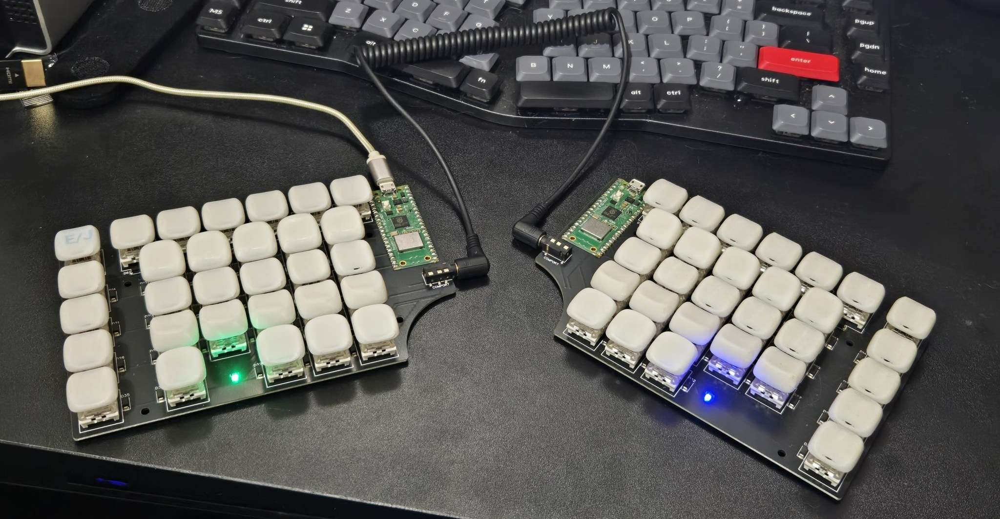

# DividedKanaKeyboard — 薙刀式 分割キーボード ファーム



左右2分割・各 Raspberry Pi Pico W、TRRS(UART)連結の自作キーボード（DIYキーボード）。
入力方式 **薙刀式 v15**（同時打鍵かな入力）を**ファームウェア側で実装**し、ローマ字シーケンスで出力するので、
ホストに専用ソフト不要（Windows / macOS / Linux 標準のローマ字IMEでそのまま動く）。

> **薙刀式について**: 薙刀式（なぎなたしき）は **大岡俊彦氏が考案** した同時打鍵式のかな入力配列です。
> 「よく使う言葉ほど打ちやすい」を狙った設計で、単打・センターシフト・連続/後置シフト・2〜3キー同時押し
> （濁音・半濁音・拗音・外来音）・編集モードを持ちます。本プロジェクトはこの薙刀式を**キーボード単体（ファーム）で再現**する試みであり、
> 配列そのものの著作・設計は大岡俊彦氏に帰属します（[クレジット](#クレジット--ライセンス)）。
> https://oookaworks.seesaa.net/article/456099128.html

> **状態（2026-06）**: 実機で実用機能フル動作。USB-HID／分割両手入力／全かな（濁音・半濁音・小書き・
> 拗音1打鍵・外来音3キー）／句読点・Enter・IME ON-OFF／編集モード／LED表示／EE_HANDS（左右自動判別）。
> 残りは **BLE無線化(#07)** のみ。コア38テスト緑。

- 要件: [要件定義.md](Documents/要件定義.md) ／ 設計: [アーキテクチャ設計書.md](Documents/アーキテクチャ設計書.md) ・ [詳細設計書.md](Documents/詳細設計書.md)
- タスク/進捗: [issues/](issues/README.md)

## 関連ツール（ブラウザで動く・インストール不要）

このファームと組み合わせて使う Web ツール。いずれも別リポジトリ [siska-tech.github.io](https://github.com/siska-tech/siska-tech.github.io) で公開（本リポジトリには含めない）。

| ツール             | URL                                              | 用途                                                                    |
| ------------------ | ------------------------------------------------ | ----------------------------------------------------------------------- |
| 🎓 **トレーナー** | <https://siska-tech.github.io/naginata-trainer/> | 薙刀式の **運指練習**。実機が無くても配列を覚えられる。まずはここで練習 |
| 🛠 **設定ツール** | <https://siska-tech.github.io/naginata-config/>  | 実機の **配列/パラメータをPCから編集**（WebHID, #12）。再ビルド不要     |

- **トレーナー**: 薙刀式 v15 の配列を覚えるための Web 練習アプリ。キーボードを買う前の素振りにも。
- **設定ツール**: Chrome/Edge の WebHID で USB 接続した実機へ直接読み書き（単打/シフト面/コンボ/編集モード/未使用キー割当/窓・リピート・LED 輝度）。COMMIT→再起動で反映。詳細は [issues/12](issues/12-pc-keymap-customizer.md)。

## ハードウェア

左右で**完全に同一の基板・配線・ファーム**。TRRS ケーブル1本で連結し、USB を挿した側が自動的にマスタになる。

| 区分            | 部品 / 仕様                    | 数量（片側） | 備考                                                 |
| --------------- | ------------------------------ | ------------ | ---------------------------------------------------- |
| MCU             | Raspberry Pi Pico W            | 1            | USB / 無線(BLE)対応。左右で計2基                     |
| キースイッチ    | Cherry MX1A-11NW               | 35           | 左右計70キー                                         |
| ダイオード      | M7（SMA）                      | 35           | 全キーに1個 → **フルNKRO**（同時押し取りこぼし無し） |
| インジケータLED | WS2812B-2020                   | 1〜2         | 役割＋シフト状態を色表示                             |
| 連結コネクタ    | PJ-320DB-5A（TRRS 4極）        | 1            | 左右間 **+5V / GND / TX / RX**（TX/RXはクロス配線）  |
| マトリクス      | 14列 × 6行（COL2ROW スキャン） | –            | 84交点中35キーを使用（疎マトリクス）                 |

- **配線（Pico W）**: GP0/GP1=UART0(TX/RX)、GP2–15=列(col0–13)、GP16–21=行(row0–5)、GP28=WS2812B、VBUS=TRRSへ+5V。
- **対称設計**: TX/RX をコネクタ側でクロスするため、左右でファーム・配線が完全共通。手番（左/右）はフラッシュに保存（EE_HANDS）。
- 詳細・ピンアサインは [要件定義.md §2](Documents/要件定義.md)。回路図・基板・BOM は `Documents/`。

## 仕組み（ソフトウェア概要）

物理キーから USB HID 出力までを、すべてキーボード内のファームで完結させる。

```
物理キー(row,col) ─▶ スキャン＋デバウンス ─▶ 手番でスキャンコードへ
   ─▶ 同時打鍵判定エンジン（薙刀式 v3：シフト体系＋2/3キーコンボ＋編集モード）
   ─▶ かな ─▶ ローマ字（か→ka, ぎゃ→gya …） ─▶ USB HID キーコード ─▶ ホストの標準IMEで確定
```

- **両半身は同一ファーム**。USB に接続された側がマスタとなり、相方のキー入力を UART で受信して統合する。
- **入力方式の核（エンジン／ローマ字変換）はハード非依存**（`naginata-core`）。ホスト上で単体テストでき、将来の移植も容易。
- 配列定義は YAML から**ビルド時にテーブル生成**（実行時パース無し）。さらに [設定ツール](https://siska-tech.github.io/naginata-config/) で**再ビルド無しのカスタマイズ**も可能。

## 構成

```
DividedKanaKeyboard/
├─ naginata-core/         ハード非依存コアロジック（no_std / ホストテスト 38件）
│  ├─ layout/naginata.yaml  薙刀式v15 配列定義（ビルド時に phf へコード生成。実行時パース無し）
│  ├─ build.rs             YAML → phf テーブル コード生成（LAYERS/COMBO2/COMBO3/MODE_*/MATRIX/SINGLE_TAP_SCS）
│  └─ src/
│     ├─ engine.rs         同時打鍵判定エンジン v3（シフト体系＋2/3キーコンボ＋編集モード, 大岡式遅延確定, 全カテゴリ Overlay #12）
│     ├─ romaji.rs         かな→ローマ字（訓令式ベース, 撥音=nn, 促音/拗音/長音）
│     ├─ hid.rs            ASCII/シンボル→USB HID（Ctrl/Shift対応）
│     ├─ config.rs         設定の中間表現(IR v2)＋serialize/parse（#12 PCカスタマイズの永続フォーマット）
│     └─ keymap.rs         生成テーブルのアクセサ（matrix→sc, layer/combo/mode lookup, Hand, ランタイム Overlay #12）
├─ firmware/              embassy(RP2040/Pico W)ファーム
│  └─ src/
│     ├─ main.rs           タスク統合（usb/scan/uart_tx/uart_rx/engine/led）＋役割判定＋EE_HANDS＋設定適用
│     ├─ matrix.rs         14col×6row COL2ROWスキャン（§2.1）
│     ├─ split.rs          左右UARTプロトコル（KeyEvent/Status, 自己同期）
│     ├─ handedness.rs     EE_HANDS（フラッシュに手番L/R保存）
│     ├─ config_store.rs   設定IRのフラッシュ永続化（#12, 末尾-2番目セクタ）
│     ├─ usb_config.rs     PC↔端末 設定チャネル（#12, vendor HID, INFO/READ/WRITE/COMMIT/RESET/REBOOT）
│     └─ usb_hid.rs        HID キーボードレポート
├─ issues/                タスク分割・進捗
└─ Documents/             設計ドキュメント（要件/アーキ/詳細）＋ 回路図 / BOM
```

> **Web ツール**（[トレーナー](https://siska-tech.github.io/naginata-trainer/) / [設定ツール](https://siska-tech.github.io/naginata-config/)）は別リポジトリで公開。本リポジトリには含めない（→「関連ツール」節）。
> 薙刀式v15 配列定義（大岡俊彦氏作成）は `Documents/Reference/`（**非公開・git管理外**）。

## ビルド & テスト

### コア（ホストで即実行）
```powershell
cargo test --manifest-path naginata-core/Cargo.toml   # 38 tests
```

### ファーム（RP2040, 要 Pico 実機で書込み）
```powershell
rustup target add thumbv6m-none-eabi
cargo install elf2uf2-rs
cd firmware                         # !! firmware内から（.cargo/config.toml の target を効かせる）
cargo build --release
elf2uf2-rs target/thumbv6m-none-eabi/release/naginata-firmware naginata-firmware.uf2
# Pico を BOOTSEL 押しながら接続 → naginata-firmware.uf2 をドラッグ
```
versions: Rust 1.96 / embassy-rp 0.10 / embassy-usb 0.6 等（詳細は issue #01）。

## 使い方（実機）

1. **両半身に同じ UF2 を書込み**、TRRSで連結。
2. **EE_HANDS 手番登録（各半身1回）**: キーを押しながらUSB挿し直し
   - スペース＋上段の外側(小指)キー → **Left** ／ スペース＋上段の内側(人差し)キー → **Right**
3. **どちらの半身をUSBに挿してもOK**（USB側がマスタ）。ホストの**ローマ字ひらがなIME**をON。
4. **LED**: 役割（マスタ=緑/スレーブ=青）＋シフト状態（センター=シアン/濁音=赤/半濁音=黄/小書き=青）。

### 入力できるもの
- 単打・**センターシフト**（スペース）・**濁音/半濁音**（逆手シフト）・**小書き**（Q）
- **拗音1打鍵**（き+や→きゃ）・**外来音3キー**（て+い+右半→てぃ 等, 大岡式遅延確定）
- 句読点（、。）・Enter（こ+な）・長音・促音・撥音・**IME ON/OFF**（HJ/FG）
- **編集モード**: D+F押しながら右手=カーソル/削除、C+V押しながら右手=コピペ/Undo/選択

### 練習・カスタマイズ
- 🎓 配列を覚える → [**トレーナー**](https://siska-tech.github.io/naginata-trainer/)（ブラウザ、実機不要）
- 🛠 配列やパラメータを変える → [**設定ツール**](https://siska-tech.github.io/naginata-config/)（WebHID で実機へ直接。再ビルド不要）

## ステータス

| 機能                                                                                     | 状態                                                        |
| ---------------------------------------------------------------------------------------- | ----------------------------------------------------------- |
| コア（engine/romaji/hid/codegen, 38テスト）                                              | ✅                                                          |
| USB-HID（1000Hz）/ COL2ROWスキャン                                                       | ✅ 実機                                                     |
| 分割UART（両手統合）/ EE_HANDS（左右自動）                                               | ✅ 実機                                                     |
| 全かな・拗音1打鍵・外来音3キー・句読点・IME・編集モード                                  | ✅ 実機                                                     |
| LEDステータス（WS2812B）                                                                 | ✅ 実機                                                     |
| **BLE-HID（cyw43+trouble-host）**                                                        | 🔲 #07（次の大物・無線化）                                 |
| **PCカスタマイズ（[WebHID 設定ツール](https://siska-tech.github.io/naginata-config/)）** | 🟡 #12 フェーズ3（物理レイアウト編集＋未使用キー直接割当） |
| 練習用 [トレーナー](https://siska-tech.github.io/naginata-trainer/)（Web）               | ✅ 公開中                                                   |
| .txtインポータ / 編集モード左手マクロ・固有名詞SC                                        | 🗄 任意                                                    |

→ 詳細・各issueは [issues/README.md](issues/README.md)。

## クレジット / ライセンス

- **薙刀式**: 考案者 **大岡氏**。本プロジェクトは薙刀式 v15 をハードウェア（ファーム）で再現したもので、
  **配列の設計・配列定義データ（`*.txt`）の著作は大岡氏に帰属**します。配列定義は本リポジトリには**含めません**
  （`Documents/Reference/` は非公開・git管理外）。薙刀式そのものの利用・入手は大岡俊彦氏の発表に従ってください。
- **ファーム / コア**: 本リポジトリのコード（`naginata-core` / `firmware`）と設計ドキュメントは作者（Siska Tech Lab.）による実装。
  使用ライブラリ: [embassy](https://embassy.dev)（RP2040/USB/PIO）、`phf`、`heapless` ほか。
- **関連 Web ツール**（[トレーナー](https://siska-tech.github.io/naginata-trainer/) / [設定ツール](https://siska-tech.github.io/naginata-config/)）は
  別リポジトリ [siska-tech.github.io](https://github.com/siska-tech/siska-tech.github.io) で公開。

### ライセンス

| 対象                                                           | ライセンス                                                                                            |
| -------------------------------------------------------------- | ----------------------------------------------------------------------------------------------------- |
| **コード**（`naginata-core/` / `firmware/`）と設計ドキュメント | **MIT** OR **Apache-2.0** のデュアル（[LICENSE-MIT](LICENSE-MIT) / [LICENSE-APACHE](LICENSE-APACHE)） |
| **ハードウェア設計**（`Documents/` の回路図 / PCB / BOM）      | **CC-BY-4.0**（[Documents/LICENSE-HARDWARE.md](Documents/LICENSE-HARDWARE.md)）                       |

コードは好きな方を選んで利用できます（Rust エコシステム標準のデュアルライセンス）。
あなたが本プロジェクトへ送信した貢献は、特に断りが無い限り上記と同じく MIT/Apache-2.0 デュアルで提供されたものとみなします。

> 謝辞: 薙刀式という優れた入力配列を公開してくださっている大岡俊彦氏に感謝します。
